<div align="center">
	
	<h1>Mais Conectado</h1>
	<p><strong>Conexão simples para pequenos negócios</strong></p>
	<p>Gestão de produtos, clientes, vendas e crédito fiado de forma moderna, rápida e acessível.</p>
	<p><a href="https://maisconectado.alwaysdata.net" target="_blank">Acessar DEMO online</a></p>
</div>

## 📚 Índice

- [Ideia do Projeto](#-ideia-do-projeto)
- [Visão Geral](#-visão-geral)
- [Funcionalidades Principais](#-funcionalidades-principais)
- [Fluxos Principais](#-fluxos-principais)
- [Telas & UX](#-telas--ux)
- [Responsividade & Acessibilidade](#-responsividade--acessibilidade)
- [Relatórios em Página Dupla](#-relatórios-em-página-dupla)
- [Arquitetura e Serviços](#-arquitetura-em-alto-nível)
- [Segurança e Sessão](#-segurança--visão-geral)
- [Testes e Instalação](#-testes-rápidos)
- [SEO, Próximas melhorias e Licença](#-seo--indexação)

## 💡 Ideia do Projeto

O Mais Conectado nasceu para eliminar processos manuais e desorganizados em pequenos comércios. A proposta é oferecer uma experiência unificada onde o dono do negócio acompanha vendas, estoque, relacionamento com clientes e concessão de crédito (fiado) com transparência e velocidade, sem precisar de conhecimento técnico avançado. O foco central é simplicidade, confiança e acesso rápido às informações essenciais do dia a dia.

> Projeto acadêmico desenvolvido como Trabalho de Conclusão de Curso (MTec PI Desenvolvimento de Sistemas — ETEC Dr. Nelson Alves Vianna). O sistema é um protótipo funcional para fins de estudo e não deve ser implantado diretamente em um comércio real sem revisão e homologação adicionais.

---

## ✨ Visão Geral

Mais Conectado é uma plataforma web construída com Laravel (PHP) e frontend progressivo que oferece:

- Controle de produtos, estoque e movimentações
- Cadastro e gestão de clientes
- Sistema de vendas com itens e totalização
- Módulo de crédito fiado transparente (limites, histórico, parcelas)
- Autenticação com fluxo de sessão + token "lembre-me" otimizado
- SEO preparado (sitemap.xml, robots.txt, meta tags, JSON-LD Organization)

## 🧩 Funcionalidades Principais

### Dashboard em tempo real

- Visão consolidada do dia (quantidade e faturamento de vendas, produtos cadastrados, clientes fiados) vinda de `InicioController`.
- Alertas automáticos de estoque baixo ao cruzar `produto.estoque_minimo` com o saldo em `estoque`.
- Últimas vendas formatadas (cliente, valor, status) para facilitar conferência rápida.

### Gestão de produtos e estoque

- CRUD completo com filtros persistidos em sessão (busca livre, categoria, ordenação, somente baixo estoque).
- Movimentos de estoque (entrada, saída e ajuste) com motivo opcional e registro em `movimentos_estoque` para auditoria.
- Histórico por produto paginado com saldo anterior/atual, evitando divergências e permitindo rastreio de cada ajuste.

### Vendas & PDV

- Carrinho inline com feedback traduzido (mensagens em `validation.php`) e validações de estoque antes da conclusão.
- Suporte a diferentes formas de pagamento (`dinheiro`, `pix`, `cartao_debito`, `cartao_credito`, `conta_fiada`).
- Cancelamento controlado (JSON ou página) e modo PDV rápido via header `X-PDV-Inline` para operações em fluxo.

### Clientes & relacionamento

- Cadastro/edição com respostas JSON para modais do front Inertia, mantendo UX fluida.
- Histórico de fiado por cliente/comércio carregado automaticamente para consulta rápida.
- Rotina de quitação de conta fiada e logs em canal `security` para rastrear cada ação administrativa.

### Crédito fiado

- Consolida até 200 registros recentes de vendas fiadas, exibindo status pago/pendente por cliente.
- Dashboard destaca maior devedor, total emprestado e quantidade de clientes com saldo em aberto.
- Serviço `ClienteService` controla limites, descrição de crédito e bloqueios quando necessário.

### Relatórios e exportações

- Tela dedicada (`RelatorioController`) com filtros por período, status, forma de pagamento e tipo de movimento.
- Resumos automáticos (quantidade, total faturado, descontos, volume movimentado) para cada consulta.
- Exportação direta para Excel (`VendasExport`) respeitando filtros ativos, pronta para compartilhar com contabilidade.

### Segurança operacional

- Policies para cada recurso sensível (Produtos, Vendas) e validações server-side antes de qualquer mutação.
- Serviços dedicados (`LoginService`, `CacheTokenService`, `SessionService`) lidam com renovação/ revogação de tokens.
- Logs centralizados no canal `security` com contexto (user_id, IP) permitem auditoria posterior.

### Configurações do usuário

- Tela de perfil com verificação de e-mail, troca de senha e exclusão de conta (com `current_password`).
- Middleware de autenticação híbrida garante que sessão ativa tenha prioridade sobre token persistente.

### Recuperação de acesso

- Fluxo dividido entre `PasswordResetLinkController` (solicita o link) e `NewPasswordController` (confirma nova senha).
- Tokens são revogados antes de enviar um novo e limpos assim que a senha é redefinida para impedir links antigos.
- Requisitos fortes (mínimo 12 caracteres + complexidade) exibidos em tempo real e `CacheTokenService` invalida sessões após a troca.

## 🧭 Fluxos Principais

1. **Onboarding do comércio**: cadastro via `RegisterController`, configuração `.env`, seed inicial (`php artisan migrate --seed`) e criação automática de comércio vinculado ao usuário.
2. **Cadastro de produto**: formulário valida SKU, estoque mínimo e categoria; após salvar, a quantidade inicial pode ser ajustada via `estoqueEntrada`.
3. **Venda no PDV**: operador seleciona cliente/produtos, o serviço calcula totais e descontos, valida estoque e registra itens + movimentações; cancelamentos devolvem estoque.
4. **Crédito fiado**: escolha forma de pagamento `conta_fiada`, saldo é atualizado em `conta_fiada` e aparece no painel/relatório; quitação zera saldo e cria log.
5. **Auditoria diária**: relatórios filtram vendas/estoque do período, permitem exportar XLSX e comparar com indicadores do dashboard para fechamento do caixa.

## 📸 Telas & UX

> Coloque as capturas em `docs/assets/screens/` com os nomes indicados abaixo para que o README as exiba automaticamente.

### Cadastro (`docs/assets/screens/cadastro.png`)

- Formulário completo para usuário + comércio em um único fluxo, com validação mínima de 12 caracteres para senha.
- Interface split screen com ilustração para reforçar confiança no onboarding.
  <div align="center">
  	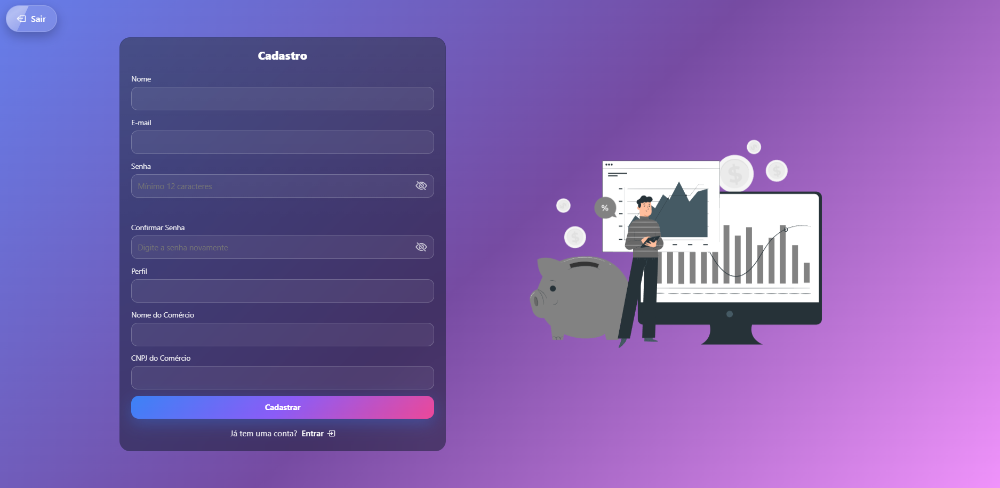
  </div>

### Login (`docs/assets/screens/login.png`)

- Campo “Lembrar-me” conectado ao middleware híbrido (sessão + token persistente).
- Acesso rápido a recuperação de senha e CTA para cadastro.
  <div align="center">
  	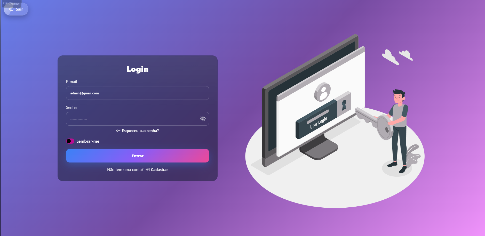
  </div>

### Esqueci minha senha (`docs/assets/screens/forgot-password.png`)

- Página enxuta que confirma sucesso/erros e explica o que acontece com o link enviado.
- Loader inclusivo e CTA para retornar ao login caso a pessoa lembre o acesso.
  <div align="center">
  	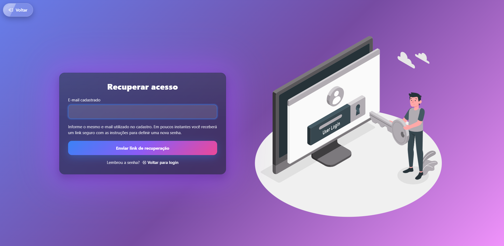
  </div>

### Redefinir senha (`docs/assets/screens/reset-password.png`)

- Validação em tempo real dos critérios (tamanho, maiúscula, número, especial) + botões para mostrar/ocultar senha.
- Bloqueia o campo de e-mail quando o link já contém o endereço verificado via token codificado.
  <div align="center">
  	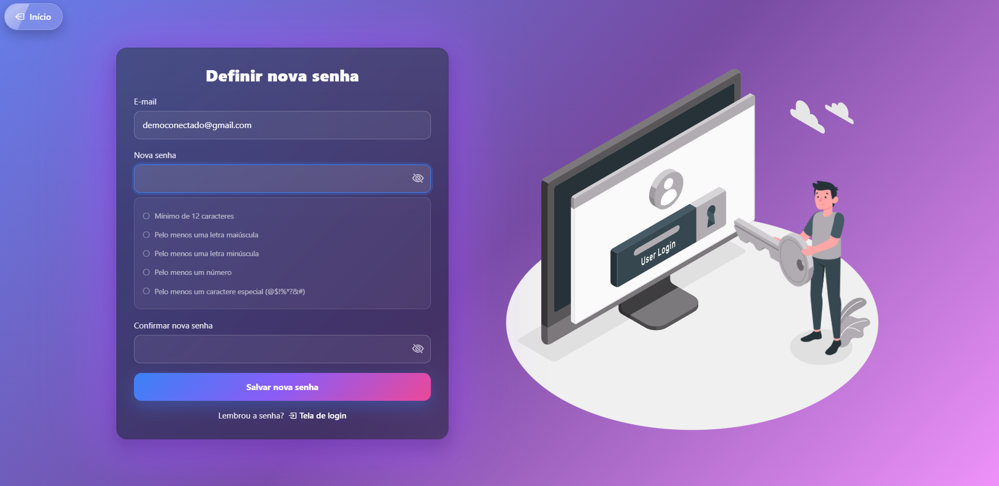
  </div>

### Dashboard (`docs/assets/screens/dashboard.png`)

- Cards com resumo do dia, alerta de estoque crítico e painel de fiado com maior devedor.
- Botões de acessibilidade (A-/A+) e modo escuro fixos no topo.
  <div align="center">
  	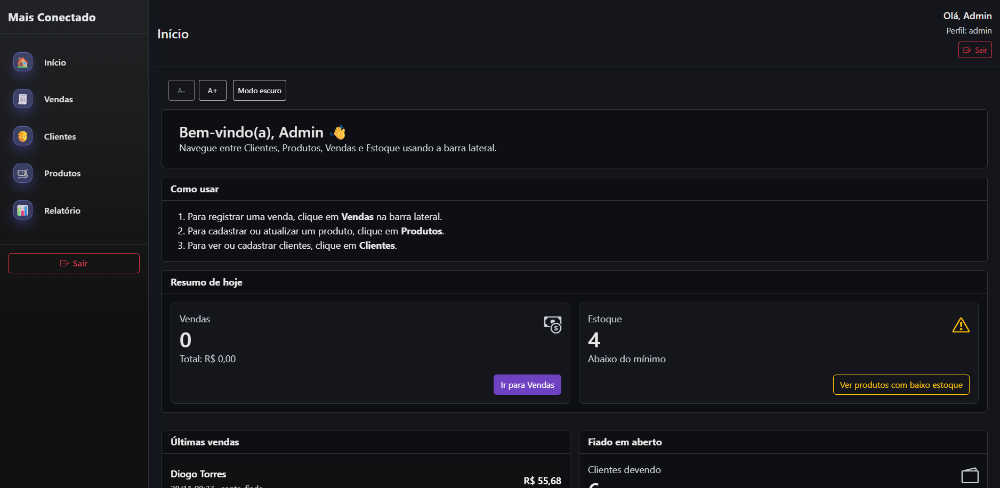
  </div>

### Histórico de Vendas (`docs/assets/screens/vendas-lista.png`)

- Filtros instantâneos por status e cliente, com botão para iniciar nova venda.
- Layout consistente com letras ampliadas e contraste alto para ambientes com pouca luz.
  <div align="center">
  	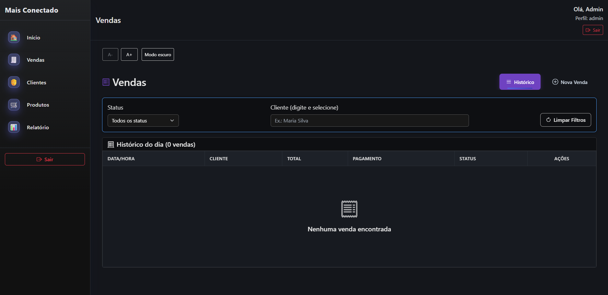
  </div>

### PDV (`docs/assets/screens/vendas-pdv.png`)

- Dupla coluna: produtos com busca por nome/categoria e carrinho com totais.
- Etiquetas exibem estoque em tempo real e alertas de “baixo estoque”.
  <div align="center">
  	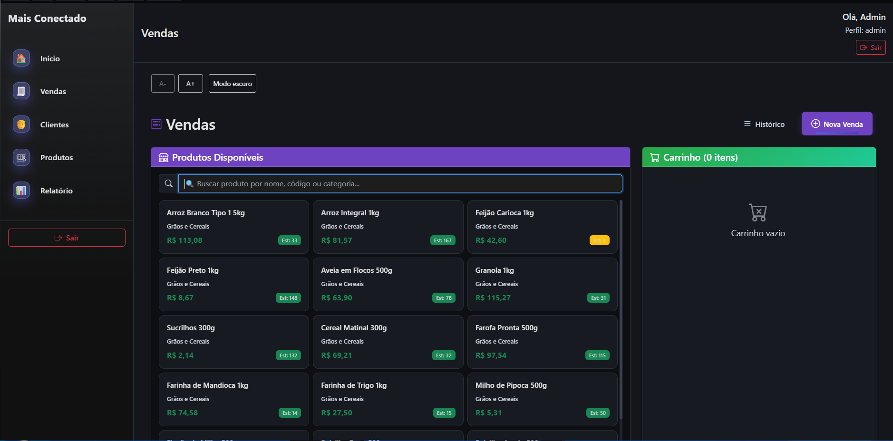
  </div>

### Clientes (`docs/assets/screens/clientes.png`)

- Foco em contas fiadas, com badge de saldo e ações rápidas (ver, pagar, editar).
- Botão “Histórico Fiadas” exibe modal alimentado por `/auth/fiado`.
  <div align="center">
  	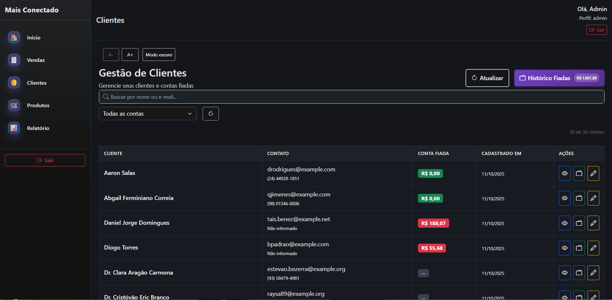
  </div>

### Produtos (`docs/assets/screens/produtos.png`)

- Tabela com ordenação, filtros por categoria e destaque para “Baixo estoque”.
- Ações agrupadas (editar, ajustar estoque, excluir) com feedback Inertia.
  <div align="center">
  	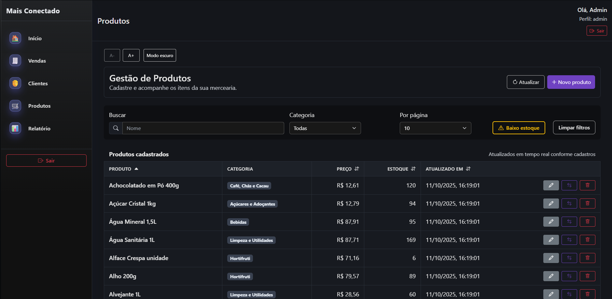
  </div>

### Relatórios (`docs/assets/screens/relatorios.png`)

- Cards com totais e histórico tabular com status colorido.
- Botões "Vendas" x "Movimentos" simulam página dupla no mesmo layout.
  <div align="center">
  	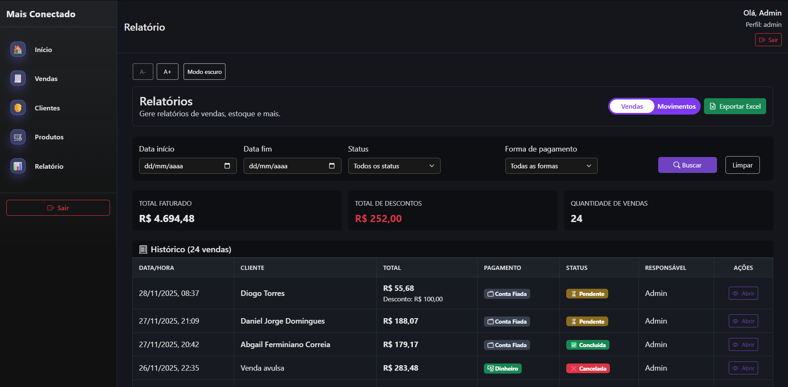
  </div>

### E-mail de recuperação (`docs/assets/screens/email-reset.png`)

- Layout escuro responsivo com botão CTA e fallback em texto para copiar o link.
- Personaliza avatar (logo ou inicial do app) e informa o tempo de expiração configurado em `config/auth.php`.
  <div align="center">
  	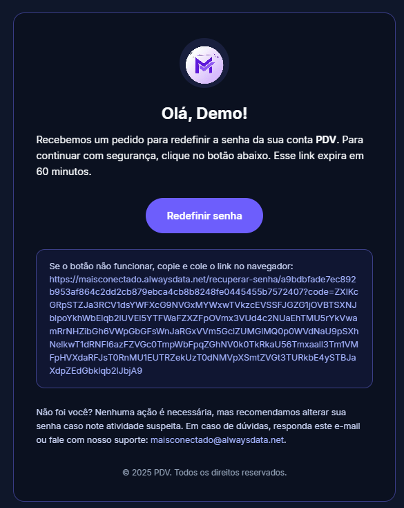
  </div>

## 🧰 Serviços internos e camadas

- `App\Services\Auth\ProdutoService` e `EstoqueService`: encapsulam regras de negócio de cadastro e movimentação, garantindo consistência transacional.
- `VendaService`: concentra cálculo de carrinho, persistência de itens e integração com estoque/fiado.
- `ClienteService`: aplica políticas de crédito e responde em JSON para uso em modais SPA.
- `CacheTokenService`, `SessionService`, `LoginService` e `LogoutService`: orquestram sessão, token "lembre-me" e invalidação centralizada.
- `VendasExport`: utiliza Laravel Excel para gerar planilhas com cabeçalhos amigáveis e timezone ajustado.

## 🚀 Tecnologias Principais

| Camada          | Stack                            |
| --------------- | -------------------------------- |
| Backend         | Laravel 12, PHP 8+               |
| Frontend        | Blade + Vite (modular CSS/JS)    |
| Build           | Vite + ESBuild                   |
| Testes          | Pest / PHPUnit                   |
| Cache / Sessões | Laravel Cache / Session          |
| SEO             | Sitemap, Robots, Structured Data |

## 🧱 Arquitetura em Alto Nível

Estruturada em camadas claras para facilitar manutenção e evolução:

- Entrada (HTTP): controllers simples + middlewares que aplicam autenticação, limites e cabeçalhos.
- Serviços: encapsulam regras de negócio (ex.: autenticação e emissão controlada de tokens) sem expor detalhes internos.
- Persistência: modelos representam entidades centrais (usuários, vendas, itens, categorias, crédito). Nomes e estrutura são deliberadamente abstraídos aqui para evitar exposição de detalhes sensíveis.
- Interface: templates Blade/CSS modular com Vite para build rápido.
- Infra: provedores registram singletons e configurações.

## 🔐 Segurança — Visão Geral

- Cabeçalhos reforçados (anti XSS, clickjacking, sniffing) e política de referência restritiva.
- Política de segurança de conteúdo (CSP) pronta para produção (descomentável) reduz superfícies de ataque.
- Limites de tentativas para login e cadastro mitigam força bruta.
- Autenticação híbrida: sessão tem precedência; token persistente só reativa acesso se válido.
- Cookies com bandeiras seguras (HttpOnly / SameSite) para redução de riscos de CSRF.
- Nunca expõe diretamente nomes de tabelas ou estruturas sensíveis no material público.

## 🔄 Sessão, Cache e "Lembre-se de mim"

Fluxo desenhado para estabilidade e mínima fricção:

- Recuperação prioritária via sessão ativa; evita recomputações desnecessárias.
- Token persistente atua como camada secundária (lembrar acesso) sem sobrescrever sessão válida.
- Renovação e revogação controladas para garantir apenas um token efetivo por usuário.
- Cache reduz leitura de banco e acelera validações sem expor segredos.

## 🛡️ Proteção contra Ataques

- Mitigação de força bruta (limites temporários por IP em pontos sensíveis).
- Minimização de riscos de fixation mantendo fluxo previsível de sessão.
- Cabeçalhos defensivos e CSP (ativável) para reduzir XSS / Injection de conteúdo.
- Proteções padrão do framework para CSRF somadas a SameSite.

## 📱 Responsividade & Acessibilidade

**Mobile-first**

- CSS utiliza grid/flex com `auto-fit/minmax` e clamp/`fluid typography` para manter legibilidade em 992px, 768px e 480px.
- Breakpoints reduzem gradualmente elementos decorativos e reorganizam cards em coluna única para priorizar formulários e indicadores.
- Componentes críticos (login, PDV e dashboard) mantêm botões de ação sempre visíveis, reposicionando o carrinho ou CTAs para a parte inferior em telas menores.

**Acessibilidade**

- Botões A-/A+ e modo escuro permanecem acessíveis no topo das páginas internas.
- Foco visível e `aria-label` aplicados em botões icônicos (por exemplo, ações da tabela de clientes/produtos).
- `prefers-reduced-motion` respeitado para reduzir animações decorativas em dispositivos sensíveis.

**Contraste & performance**

- Tokens de cor respeitam WCAG AA tanto no tema claro quanto escuro.
- Imagens e ilustrações usam `object-fit` + `loading="lazy"`; o primeiro banner tem `fetchpriority="high"` para evitar atrasos em conexões móveis.
- Vídeo de demonstração (`docs/assets/responsividade.mp4`) mostra o comportamento mobile; <a href="docs/assets/responsividade.mp4">assista aqui</a> para ver a transição dos layouts.

## 📊 Relatórios em Página Dupla

- A mesma tela (`RelatorioController@index`) entrega duas visões: **Vendas** e **Movimentos de estoque**, alternadas pelos botões no topo (tabs simulando “página dupla”).
- Cada aba mantém o cabeçalho com filtros (intervalo de datas, status, forma de pagamento ou tipo de movimento) e cards de resumo.
- A troca de aba reaproveita o estado atual, evitando round-trips desnecessárias; apenas o dataset exibido muda.
- Exportação para Excel respeita o contexto corrente e inclui timezone/localização PT-BR para números e datas.

## 📷 Imagem de Capa

O arquivo atual (`docs/assets/cover.jpeg`) já é usado no topo do README. Sempre que quiser atualizar o visual, gere um screenshot em 1920x1080 e substitua essa imagem.

Para o preview social do GitHub (imagem exibida ao compartilhar o link do repositório), crie `docs/assets/social-preview.png` em 1280x640 e configure em **Settings > Social preview**.

## 🗂️ Estrutura Simplificada

```
public/            # Arquivos públicos (index.php, sitemap, favicon, logo)
resources/views/   # Blade templates (home, login, cadastro, componentes)
resources/css/     # Estilos segmentados (home, navbar, etc.)
app/Models/        # Modelos: Produto, Categoria, Cliente, Venda...
app/Http/Middleware/RequireTokenOrSession.php  # Middleware otimizado de sessão/token
database/migrations/  # Estrutura das tabelas
tests/            # Testes Pest / PHPUnit
```

## 🔐 Fluxo de Autenticação "Lembre-me"

1. Sessão ativa sempre tem prioridade
2. Token persistente só recria sessão se válido e usuário não estiver autenticado
3. Invalidar token não força logout imediato se sessão estável existir
4. Middleware unifica lógica (verificação cache + DB)

## 🧪 Testes Rápidos

Execute a suíte básica:

```bash
php artisan test
```

Ou com Pest:

```bash
./vendor/bin/pest
```

## ⚙️ Instalação

```bash
git clone <repo>
cd TCC
composer install
cp .env.example .env
php artisan key:generate
php artisan migrate --seed
npm install
npm run build   # ou npm run dev para ambiente de desenvolvimento
php artisan serve
```

## 🌐 SEO & Indexação

- `public/sitemap.xml` gera estrutura para indexação
- `public/robots.txt` permite crawl geral
- JSON-LD em `public/organization.json` descreve a marca
- Meta tags otimizadas na `home.blade.php`
- Social preview configurável (Settings > Social preview) usando `docs/assets/social-preview.png` (1280x640)

## ⚙️ Ativação da CSP em Produção

No middleware de cabeçalhos, descomente a linha da Content-Security-Policy e ajuste domínios confiáveis (origem própria + CDNs usados).

## © Direitos Autorais & Uso

© 2025 Pablo Braz & Gabriel Faria. Todos os direitos reservados.

Este repositório é disponibilizado para fins educacionais e avaliação técnica. Qualquer reutilização comercial, distribuição ou derivação significativa dos arquivos exige autorização explícita dos autores.

> Aviso: não autorizado para operação em ambientes produtivos ou manipulação de dados reais sem supervisão e contratos específicos. Utilize somente para estudos, demonstrações e análises acadêmicas.

Contato para permissões e dúvidas:

- Pablo Braz: pbraz0460@gmail.com
- Gabriel Faria: gabrielfariadossantos1382007@gmail.com

Ao clonar ou reutilizar partes do código, mantenha este aviso e referências de autoria.

## 🛠 Próximas Melhorias Sugeridas

- Painel analítico (gráficos de vendas e estoque)
- API REST para integrações externas
- Filas (queue) para notificações e e-mails
- Internacionalização completa (multi-idioma)
- Integração com APIs de pagamento de parceiros (PIX/maquininhas) para automatizar a etapa de cobrança nas vendas
- Login com Google (OAuth 2.0) e demais provedores sociais para reduzir atrito no acesso
- Aplicativo/PWA offline-first para registrar vendas mesmo sem internet e sincronizar depois
- Integração com impressoras fiscais/NFC-e para adequação a legislações estaduais

## 🤝 Contribuição

Pull requests são bem-vindos. Abra uma issue com contexto claro. Mantenha padrão PSR-12 e escreva pelo menos um teste para novas regras de negócio.

## 📄 Licença

MIT. Sinta-se livre para usar e adaptar com atribuição.

## 🧾 Créditos

Baseado em arquitetura Laravel moderna + ajustes personalizados para fluxo de sessão/token e SEO.

### Contexto acadêmico

- **Curso:** MTec PI Desenvolvimento de Sistemas
- **Instituição:** ETEC Dr. Nelson Alves Vianna (Tietê/SP)
- **Orientadores:** Daniel Formigari Guerrero e Thomas Galuci Evangelista
- **Menções honrosas:** Professores Eliton Camargo de Oliveira e Anderson Ascenção Donaire, fundamentais para a nossa formação técnica

---

Se este projeto ajudou você, considere dar uma ⭐ no repositório!
