<div align="center">
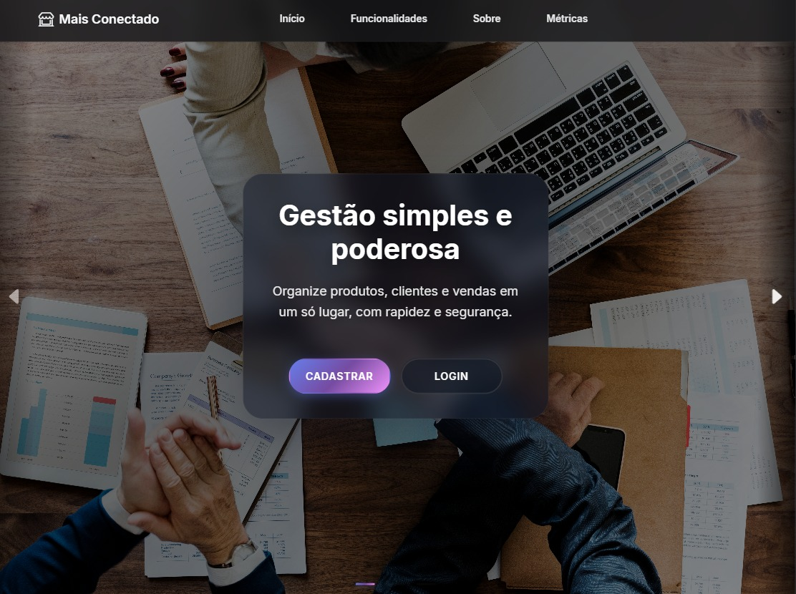

<h1>Mais Conectado</h1>

<p align="center">


</p>

<p><strong>Conexão simples para pequenos negócios</strong></p>
<p>Gestão de produtos, clientes, vendas e crédito fiado de forma moderna, rápida e acessível.</p>

<p>
<a href="https://maisconectado.alwaysdata.net" target="_blank"><strong>🔗 Acessar DEMO online</strong></a>
</p>

<p>
<em>Credenciais de Teste:</em><br>
<strong>Email:</strong> teste@teste.com<br>
<strong>Senha:</strong> Teste1234567$
</p>
</div>

## 📚 Índice

- [Ideia do Projeto](#-ideia-do-projeto)
- [Visão Geral](#-visão-geral)
- [Funcionalidades Principais](#-funcionalidades-principais)
- [Fluxos Principais](#-fluxos-principais)
- [Telas & UX](#-telas--ux)
- [Responsividade & Acessibilidade](#-responsividade--acessibilidade)
- [Relatórios em Página Dupla](#-relatórios-em-página-dupla)
- [Arquitetura, Serviços e Segurança](#-arquitetura-serviços-e-segurança)
- [Testes e Instalação](#-testes--instalação)
- [SEO, Próximas melhorias e Licença](#-seo--indexação)

## 💡 Ideia do Projeto

O Mais Conectado nasceu para eliminar processos manuais e desorganizados em pequenos comércios. A proposta é oferecer uma experiência unificada onde o dono do negócio acompanha vendas, estoque, relacionamento com clientes e concessão de crédito (fiado) com transparência e velocidade, sem precisar de conhecimento técnico avançado. O foco central é simplicidade, confiança e acesso rápido às informações essenciais do dia a dia.

> Projeto acadêmico desenvolvido como Trabalho de Conclusão de Curso (MTec PI Desenvolvimento de Sistemas — ETEC Dr. Nelson Alves Vianna). O sistema é um protótipo funcional para fins de estudo e não deve ser implantado diretamente em um comércio real sem revisão e homologação adicionais.

---

## ✨ Visão Geral

Mais Conectado é uma plataforma web construída com Laravel (PHP) e frontend progressivo que oferece:

- Controle de produtos, estoque e movimentações
- Cadastro e gestão de clientes
- Sistema de vendas com itens e totalização
- Módulo de crédito fiado transparente (limites configuráveis, histórico, saldo em aberto)
- Autenticação com fluxo de sessão + token "lembrar-me" otimizado
- SEO preparado (sitemap.xml, robots.txt, meta tags, JSON-LD Organization)

## 🧩 Funcionalidades Principais

### Dashboard em tempo real

- Visão consolidada do dia (quantidade e faturamento de vendas, produtos cadastrados, clientes fiados) vinda de `InicioController`.
- Alertas automáticos de estoque baixo ao cruzar `produto.estoque_minimo` com o saldo em `estoque`.
- Últimas vendas formatadas (cliente, valor, status) para facilitar conferência rápida.

### Gestão de produtos e estoque

- CRUD completo com filtros persistidos em sessão (busca livre, categoria, ordenação, somente baixo estoque).
- Movimentos de estoque (entrada, saída e ajuste) com motivo opcional e registro em `movimentos_estoque` para auditoria.

### Vendas & PDV

- Carrinho inline com feedback (mensagens em `validation.php`) e validações de estoque antes da conclusão.
- Suporte a diferentes formas de pagamento (`dinheiro`, `pix`, `cartao_debito`, `cartao_credito`, `conta_fiada`).
- Cancelamento controlado (JSON ou página) e modo PDV rápido via header `X-PDV-Inline` para operações em fluxo.

### Clientes & relacionamento

- Cadastro/edição com respostas JSON para modais do front Inertia, mantendo UX fluida.
- Histórico de fiado por cliente/comércio carregado automaticamente para consulta rápida.
- Rotina de quitação de conta fiada e logs em canal `security` para rastrear cada ação administrativa.

### Crédito fiado

- Consolida até 200 registros recentes de vendas fiadas, exibindo status pago/pendente por cliente.
- Dashboard destaca maior devedor, total e quantidade de clientes com saldo em aberto.
- Serviço `ClienteService` controla limites, descrição de crédito e bloqueios quando necessário.

### Relatórios e exportações

- Tela dedicada (`RelatorioController`) com filtros por período, status, forma de pagamento e tipo de movimento.
- Resumos automáticos (quantidade, total faturado, descontos, volume movimentado) para cada consulta.
- Exportação direta para Excel (`VendasExport`) respeitando filtros ativos, pronta para compartilhar com contabilidade.

### Segurança operacional

- Policies para cada recurso sensível (Produtos, Vendas) e validações server-side antes de qualquer mutação.
- Serviços dedicados (`LoginService`, `CacheTokenService`, `SessionService`) lidam com renovação/ revogação de tokens.
- Logs centralizados no canal `security` com contexto (user_id, IP) permitem auditoria posterior.

### Sessões e autenticação

- Fluxo de login/logout personalizado garante que apenas o responsável pelo comércio mantenha acesso;
- Middleware de autenticação híbrida garante que sessão ativa tenha prioridade sobre token persistente, evitando logins conflitantes entre dispositivos.

### Recuperação de acesso

- Fluxo dividido entre `PasswordResetLinkController` (solicita o link) e `NewPasswordController` (confirma nova senha).
- Tokens são revogados antes de enviar um novo e limpos assim que a senha é redefinida para impedir links antigos.
- Requisitos fortes (mínimo 12 caracteres + complexidade) exibidos em tempo real e `CacheTokenService` revoga tokens persistidos para impedir logins antigos.

## 🧭 Fluxos Principais

1. **Onboarding do comércio**: cadastro via `RegisterController`, configuração `.env`, seed inicial (`php artisan migrate --seed`) e criação automática de comércio vinculado ao usuário.
2. **Cadastro de produto**: formulário valida SKU, estoque mínimo e categoria; após salvar, a quantidade inicial pode ser ajustada via `estoqueEntrada`.
3. **Venda no PDV**: operador seleciona cliente/produtos, o serviço calcula totais e descontos, valida estoque e registra itens + movimentações; cancelamentos devolvem estoque.
4. **Crédito fiado**: escolha forma de pagamento `conta_fiada`, saldo é atualizado em `conta_fiada` e aparece no painel/relatório; quitação zera saldo e cria log.
5. **Auditoria diária**: relatórios filtram vendas/estoque do período, permitem exportar XLSX e comparar com indicadores do dashboard para fechamento do caixa.

## 📸 Telas & UX (`docs/assets/screens/`)

### Cadastro

- Formulário completo para usuário + comércio em um único fluxo, com validação mínima de 12 caracteres para senha + complexidade.
- Interface split screen com ilustração para reforçar confiança no onboarding.
      <div align="center">
      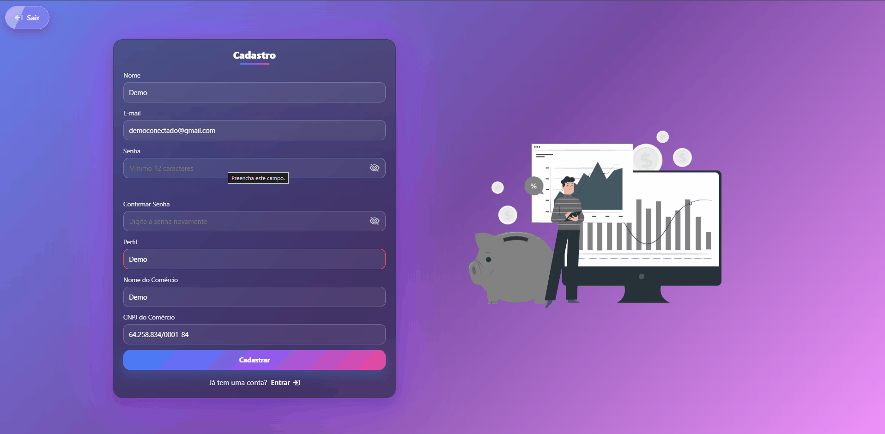
      </div>

### Login

- Campo “Lembrar-me” conectado ao middleware híbrido (sessão + token persistente).
- Acesso rápido a recuperação de senha e CTA para cadastro.
      <div align="center">
      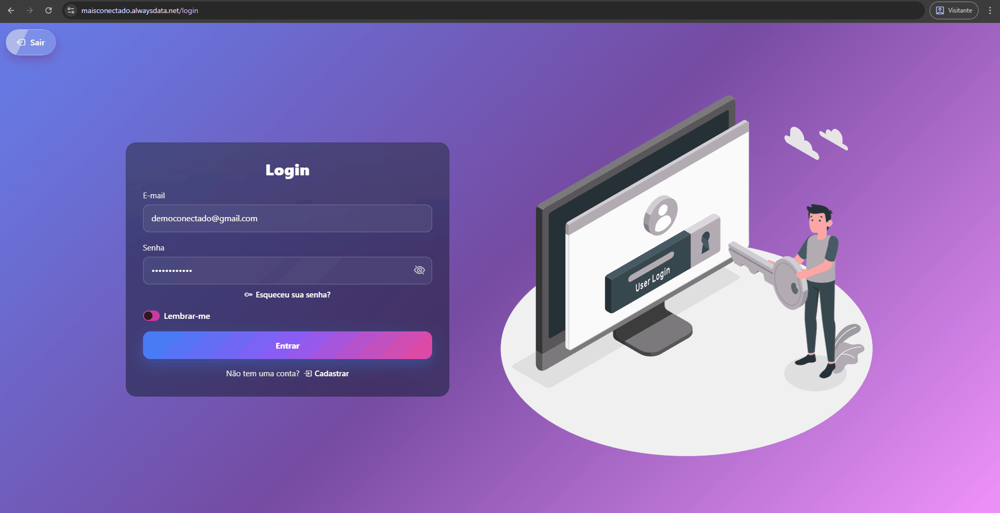
      </div>

### Esqueci minha senha

- Página enxuta que confirma sucesso/erros e explica o que acontece com o link enviado.
- Loader inclusivo e CTA para retornar ao login caso a pessoa lembre o acesso.
      <div align="center">
      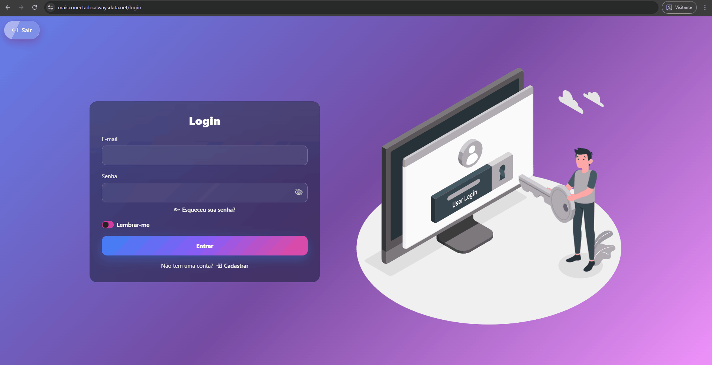
      </div>

### Redefinir senha

- Validação em tempo real dos critérios (tamanho, maiúscula, número, especial) + botões para mostrar/ocultar senha.
- Bloqueia o campo de e-mail, o link já contém o endereço verificado via token codificado.
      <div align="center">
      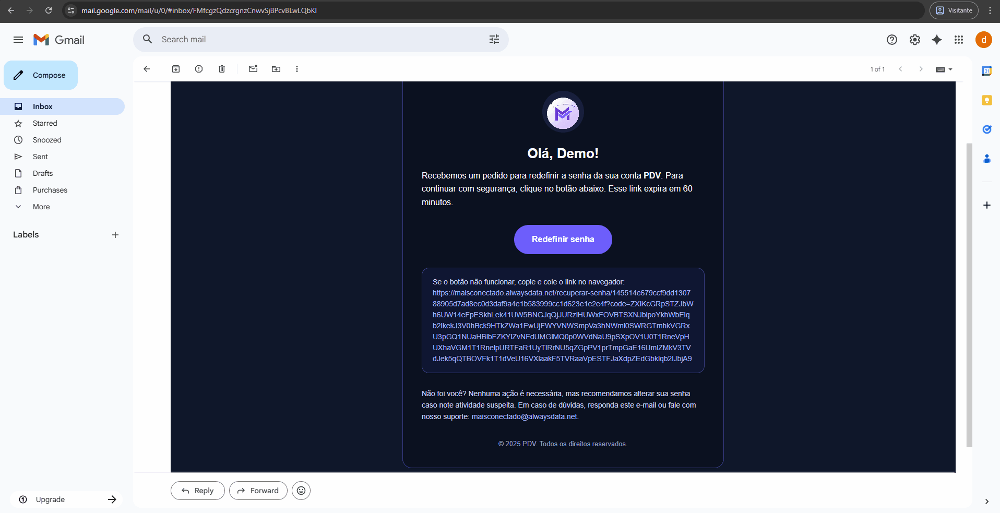
      </div>

### Dashboard

- Cards com resumo do dia, alerta de estoque crítico e painel de fiado com maior devedor.
- Botões de acessibilidade (A-/A+) e modo escuro fixos no topo, presentes em todas as páginas.
      <div align="center">
      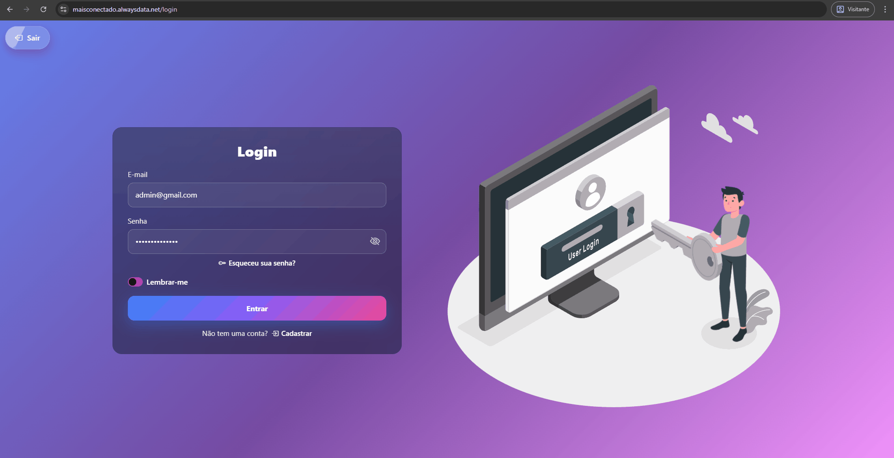
      </div>

### Histórico de Vendas

- Filtros instantâneos por status e cliente, com botão para iniciar nova venda.
- Layout consistente com letras ampliadas e contraste alto.
      <div align="center">
      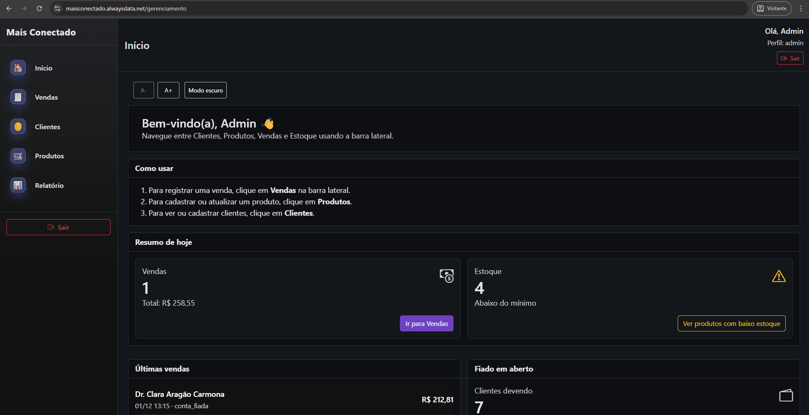
      </div>

### PDV

- Dupla coluna: produtos com busca por nome/categoria e carrinho com totais.
- Etiquetas exibem estoque em tempo real e alertas de “baixo estoque”.
      <div align="center">
      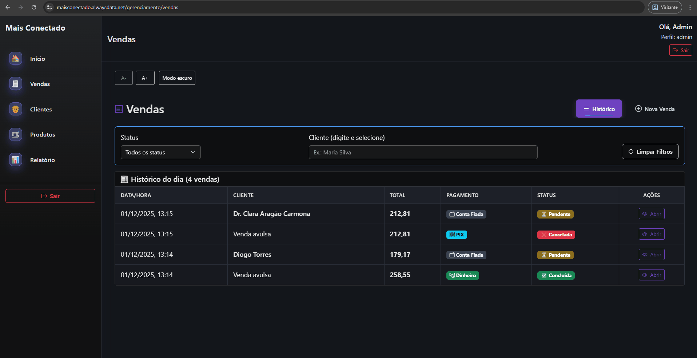
      </div>

### Clientes

- Foco em contas fiadas, com badge de saldo e ações rápidas (ver, pagar, editar).
- Botão “Histórico Fiadas” exibe modal alimentado por `/auth/fiado`.
      <div align="center">
      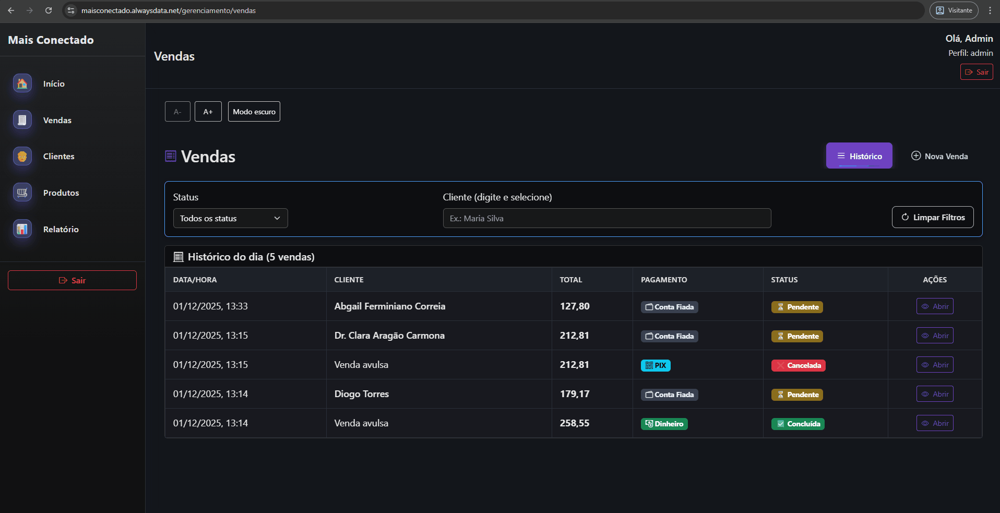
      </div>

### Produtos

- Tabela com ordenação, filtros por categoria e destaque para “Baixo estoque”.
- Ações agrupadas (editar, ajustar estoque, excluir) com feedback Inertia.
      <div align="center">
      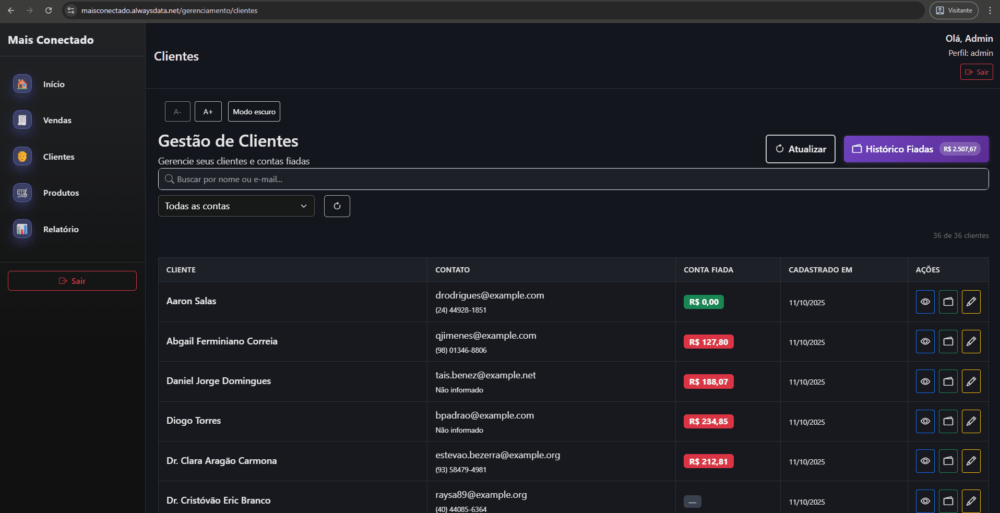
      </div>

### Relatórios

- Cards com totais e histórico tabular com status.
- Botões "Vendas" x "Movimentos" página dupla no mesmo layout.
      <div align="center">
      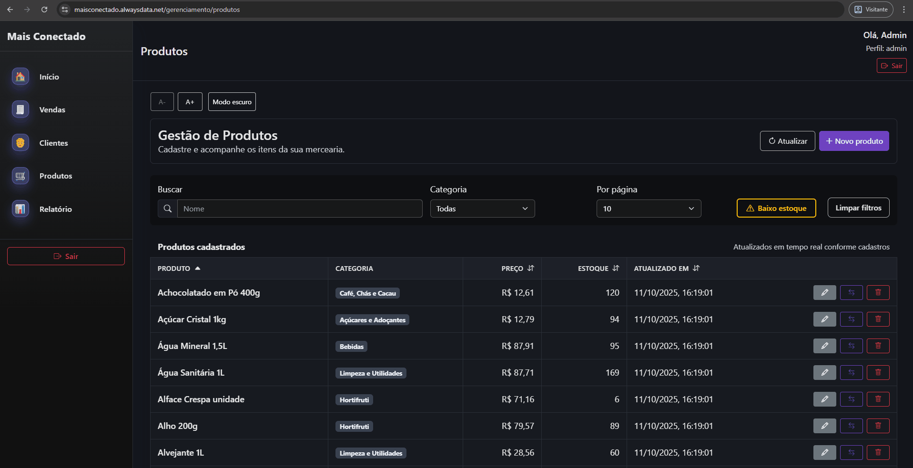
      </div>

### Tour guiado

- Passeio interativo baseado em Shepherd evidencia os pontos críticos do painel (dashboard, vendas, clientes, produtos e relatórios).
- Para novos dispositivos ele roda automaticamente uma vez graças ao controle em `localStorage`.
    <div align="center">
      
    </div>

### E-mail de recuperação

- Layout escuro responsivo com botão CTA e fallback em texto para copiar o link.
- Personaliza avatar e informa o tempo de expiração configurado em `config/auth.php`.
      <div align="center">
      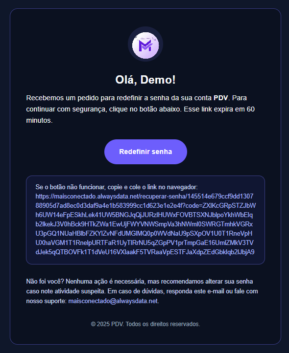
      </div>


## 🚀 Tecnologias Principais

| Camada           | Stack                             |
| ---------------- | --------------------------------- |
| Backend          | Laravel 12, PHP 8.2+              |
| Frontend         | Blade + Vite (modular CSS/JS)     |
| Build            | Vite + ESBuild                    |
| Testes           | Pest / PHPUnit                    |
| Cache / Sessões  | Laravel Cache / Session           |
| SEO              | Sitemap, Robots, Structured Data  |

## 🏛 Arquitetura, Serviços e Segurança

**Arquitetura em camadas**

- Entrada (HTTP) com controllers enxutos e middlewares que cuidam de autenticação, limites e cabeçalhos defensivos.
- Serviços concentram regras de negócio e mantêm modelos focados nas entidades centrais (usuários, vendas, itens, categorias, crédito).
- Interface baseada em Blade + Vite com assets modulares; provedores registram singletons e integrações compartilhadas.

**Serviços e componentes principais**

- `ProdutoService` + `EstoqueService`: cadastros, validações e auditoria de movimentações.
- `VendaService`: cálculo de carrinho, persistência de itens, integração estoque/fiado e cancelamentos consistentes.
- `ClienteService`: políticas de crédito, respostas em JSON para o front Inertia e logs de ações administrativas.
- `CacheTokenService`, `SessionService`, `LoginService`, `LogoutService`: autenticação híbrida, renovação/revogação de tokens e limpeza de sessões após reset de senha.
- `VendasExport`: geração de planilhas Excel (timezone PT-BR) para contabilidade e análises externas.

**Sessões, cache e tokens persistentes**

- Sessão ativa tem prioridade; tokens "lembrar-me" recriam o login apenas quando não há usuário autenticado.
- Apenas um token ativo por usuário, com renovação e revogação automática durante logouts ou redefinição de senha.
- Cache reduz leituras no banco e mantém o fluxo estável mesmo após quedas de conexão.

**Controles de segurança**

- Cabeçalhos reforçados (anti-XSS, clickjacking, sniffing) e Content-Security-Policy pronta para produção.
- Limites de tentativas em login/cadastro e mitigação de fixation preservam a integridade das sessões.
- Cookies com HttpOnly/SameSite somados às proteções CSRF do Laravel.
- Logs no canal `security` registram user_id, IP e contexto de ações sensíveis para auditoria.

## 📱 Responsividade & Acessibilidade

**Mobile-first**

- CSS utiliza grid/flex com `auto-fit/minmax` e clamp/`fluid typography` para manter legibilidade em 992px, 768px e 480px.
- Breakpoints reduzem gradualmente elementos decorativos e reorganizam cards em coluna única para priorizar formulários e indicadores.
- Componentes críticos (login, PDV e dashboard) mantêm botões de ação sempre visíveis, reposicionando o carrinho ou CTAs para a parte inferior em telas menores.

**Acessibilidade**

- Botões A-/A+ e modo escuro permanecem acessíveis no topo das páginas internas.
- Foco visível e `aria-label` aplicados em botões icônicos (por exemplo, ações da tabela de clientes/produtos).
- `prefers-reduced-motion` respeitado para reduzir animações decorativas em dispositivos sensíveis.

**Contraste & performance**

- Tokens de cor respeitam WCAG AA tanto no tema claro quanto escuro.
- Imagens e ilustrações usam `object-fit` + `loading="lazy"`; o primeiro banner tem `fetchpriority="high"` para evitar atrasos em conexões móveis.
- Vídeo de demonstração (`docs/assets/responsividade.mp4`) mostra o comportamento mobile; <a href="docs/assets/responsividade.mp4">assista aqui</a> para ver a transição dos layouts (Baixe o RAW).

## 📊 Relatórios em Página Dupla

- A mesma tela (`RelatorioController@index`) entrega duas visões: **Vendas** e **Movimentos de estoque**, alternadas pelos botões no topo (tabs simulando “página dupla”).
- Cada aba mantém o cabeçalho com filtros (intervalo de datas, status, forma de pagamento ou tipo de movimento) e cards de resumo.
- A troca de aba reaproveita o estado atual, evitando round-trips desnecessárias; apenas o dataset exibido muda.
- Exportação para Excel respeita o contexto corrente e inclui timezone/localização PT-BR para números e datas.

## 🗂️ Estrutura Simplificada

- `public/` – Arquivos públicos (`index.php`, `sitemap.xml`, favicon, logo)
- `resources/views/` – Templates Blade (home, login, cadastro, componentes)
- `resources/css/` – Estilos segmentados (home, navbar, etc.)
- `app/Models/` – Modelos (`Produto`, `Categoria`, `Cliente`, `Venda`...)
- `app/Http/Middleware/RequireTokenOrSession.php` – Middleware otimizado de sessão/token
- `database/migrations/` – Estrutura das tabelas
- `tests/` – Testes Pest / PHPUnit

## 🧪 Instalação

**Configuração rápida**

```bash
git clone https://github.com/GabFaria2270/TCC.git
cd TCC
composer install
cp .env.example .env
php artisan key:generate
php artisan migrate
php artisan db:seed --class=Database\Seeders\AutoPopulateSeeder
npm install
npm run dev
php artisan serve
```

## 🌐 SEO & Indexação

- `public/sitemap.xml` gera estrutura para indexação.
- `public/robots.txt` permite crawl geral.
- JSON-LD em `public/organization.json` descreve a marca.
- Meta tags otimizadas em `resources/views/home.blade.php`.
- Social preview configurável (Settings > Social preview) usando `docs/assets/social-preview.png` (1280x640).

© Direitos Autorais & Licença de Uso
© 2025 Pablo Braz & Gabriel Faria. Todos os direitos reservados.

Este repositório contém código proprietário desenvolvido como parte de um Trabalho de Conclusão de Curso. Ele é disponibilizado publicamente apenas para fins de:

Avaliação acadêmica e técnica.

Demonstração de portfólio (Source Available).

Restrições:

🚫 É proibida a comercialização deste software ou de partes dele.

🚫 É proibida a redistribuição ou criação de trabalhos derivados sem a permissão expressa por escrito dos autores.

🚫 Não autorizado para uso em ambientes de produção comercial.

Para dúvidas ou solicitações de uso:

Pablo Braz: pbraz0460@gmail.com

Gabriel Faria: gabrielfariadossantos1382007@gmail.com

🛠 Próximas Melhorias
Painel analítico (gráficos de vendas e estoque)

API REST para integrações externas

Filas (queue) para notificações e e-mails

Internacionalização completa (multi-idioma)

Integração com APIs de pagamento de parceiros (PIX/maquininhas) para automatizar a etapa de cobrança nas vendas

Login com Google (OAuth 2.0) e demais provedores sociais para reduzir atrito no acesso

Aplicativo/PWA offline-first para registrar vendas mesmo sem internet e sincronizar depois

Integração com impressoras fiscais/NFC-e para adequação a legislações estaduais

🧾 Créditos
Baseado em arquitetura Laravel moderna + ajustes personalizados para fluxo de sessão/token e SEO.

Contexto acadêmico
Curso: MTec PI Desenvolvimento de Sistemas

Instituição: ETEC Dr. Nelson Alves Vianna (Tietê/SP)

Orientadores: Daniel Formigari Guerrero e Thomas Galuci Evangelista

Menções honrosas: Professores Eliton Camargo de Oliveira e Anderson Ascenção Donaire, fundamentais para a nossa formação técnica

Se este projeto ajudou você a entender melhor o desenvolvimento Laravel, considere dar uma ⭐ no repositório!
